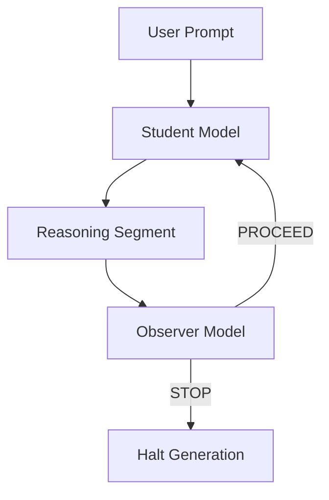

# Catching Reasoning Before It Derails

**Supervising reasoning trajectories at inference time to prevent hallucination cascades and reasoning drift.**

[](LICENSE)
[](https://www.python.org/)
[](https://arxiv.org/)
[](https://github.com/pranav-k-27/catching-reasoning-before-it-derails)

📄 **Paper:** [Catching Reasoning Before It Derails: Inference-Time Process Supervision for Large Language Models](#citation)  
🔗 **Code:** [GitHub Repository](https://github.com/pranav-k-27/catching-reasoning-before-it-derails)

---

> *"Not all errors appear at the end — many form early and silently."*

This project introduces inference-time process supervision for Large Language Models (LLMs), enabling early detection and prevention of reasoning failures before they cascade into confident but incorrect outputs.

---

## Table of Contents

- [Core Insight](#core-insight)
- [Key Contributions](#key-contributions)
- [System Architecture](#system-architecture)
- [Failure Modes Detected](#failure-modes-detected)
- [Experimental Tasks](#experimental-tasks)
- [Results](#representative-results)
- [Quick Start](#quick-start)
- [Repository Structure](#repository-structure)
- [Citation](#citation)
- [License](#license)

---

## Core Insight

Modern LLMs increasingly rely on extended inference-time reasoning. While longer reasoning can improve accuracy, it also introduces a critical failure mode: **early semantic or logical errors propagate unchecked**, leading to hallucination cascades and wasted compute.

This repository demonstrates that monitoring reasoning *during* generation—rather than only evaluating final answers—enables:

- Early detection of flawed reasoning paths
- Selective intervention without suppressing valid exploration
- Significant reduction in inference-time compute waste

---

## Key Contributions

| Contribution | Description |
|--------------|-------------|
| **Process Supervision** | Evaluates reasoning segments instead of final outputs |
| **Dual-Model Framework** | High-capability Student + lightweight Observer |
| **Early Intervention** | Stops flawed reasoning before it compounds |
| **Failure Typing** | Identifies premise, circular, ethical, and logical errors |
| **Compute Efficiency** | Reduces token usage while preserving correctness |

---

## System Architecture

### High-Level Flow

```
User Prompt
     ↓
Student Model (Reasoning Generator)
     ↓
Intermediate Reasoning Segment
     ↓
Observer Model (Logic Auditor)
 ├── PROCEED → Continue generation
 └── STOP → Early termination
```

### Conceptual Diagram



---

## Failure Modes Detected

| Failure Type | Description |
|--------------|-------------|
| **Premise** | Invalid or hallucinated assumptions |
| **Circular** | Self-referential or paradoxical reasoning |
| **Mitigation** | Ignoring obvious constraints or risks |
| **Ethical** | Oversimplified moral reasoning |
| **Inconsistency** | Logical contradiction |

---

## Experimental Tasks

The framework is evaluated across four stress-test categories designed to expose reasoning failures:

| Category | Example |
|----------|---------|
| Business Strategy | Vegan steakhouse in a cattle-ranching town |
| Logic Traps | "If 2 shirts take 2 hours to dry, how long do 20 take?" |
| Ethical Dilemmas | Organ allocation scenarios |
| Logical Paradoxes | Liar-style self-referential statements |

Each task is run:
- **With** inference-time supervision
- **Without** supervision (student-only baseline)

---

## Representative Results

### Example: Logic Trap (Drying Shirts)

| Setting | Outcome | Tokens Used |
|---------|---------|-------------|
| Student-only | ❌ Incorrect (20 hours) | ~500 |
| Supervised | ⛔ Stopped early | ~150 |

**Key Observation:** The observer halts reasoning before the model commits to an invalid premise.

---

## Quick Start

### Prerequisites

- Python >= 3.8
- pip >= 21.0

### Installation

```bash
git clone https://github.com/pranav-k-27/catching-reasoning-before-it-derails.git
cd catching-reasoning-before-it-derails
pip install -r requirements.txt
```

### Run Experiments

```bash
python experiments/run_experiments.py
```

Logs are written to `logs/results.jsonl`.

---

## Repository Structure

```
catching-reasoning-before-it-derails/
├── README.md               # This file
├── LICENSE                 # MIT License
├── requirements.txt        # Dependencies
│
├── student.py              # Student model interface
├── observer.py             # Observer (logic auditor)
│
├── experiments/
│   └── run_experiments.py  # Main experiment runner
│
├── logs/
│   └── results.jsonl       # Experiment logs
│
└── figures/
    ├── architecture.mmd    # System diagram
    └── plot_tokens.py      # Token usage visualization
```

---

## Dependencies

```
huggingface_hub
numpy
```

---

## Citation

If you use this work, please cite:

```bibtex
@article{vachharajani2026catching,
  title={Catching Reasoning Before It Derails: Inference-Time Process Supervision for Large Language Models},
  author={Vachharajani, Pranav},
  year={2026},
  note={arXiv preprint}
}
```

---

## Limitations

- Requires observable intermediate reasoning
- Observer is itself a learned model
- Fixed intervention point (non-adaptive)
- Focuses on qualitative causal analysis, not leaderboard benchmarks

These are discussed in detail in the paper.

---

## Future Work

- Adaptive or multi-stage intervention points
- Observer ensembles
- Training observers with explicit supervision
- Integration with agentic planning systems

---

## License

This project is licensed under the MIT License — see the [LICENSE](LICENSE) file for details.

---

## Contact

**Pranav Vachharajani**  
PhD Researcher — AI Safety, Reasoning & Reliability

[](https://github.com/pranav-k-27)

---

<p align="center">
  <b>If you find this work useful, please consider giving it a ⭐!</b>
</p>
